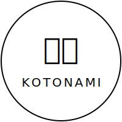

# 🌊 Kotonami

<div align="center">



**An immersive streaming platform for Japanese language learning**

[](https://reactjs.org/)
[](https://vitejs.dev/)
[](https://developer.mozilla.org/en-US/docs/Web/JavaScript)
[](LICENSE)

[🚀 Live Demo](#) • [📖 Documentation](#) • [🐛 Report Bug](#) • [💡 Request Feature](#)

</div>

---

## 🎯 What is Kotonami?

Kotonami (言波 - "word waves") revolutionizes Japanese language learning through **immersive video streaming**. Unlike traditional learning platforms, Kotonami provides instant, contextual word breakdowns directly within video content, making language acquisition natural and engaging.

### 🌟 Why Choose Kotonami?

- 📺 **100+ Curated Videos** - Anime, daily life vlogs, interviews, podcasts, and audiobooks
- 🔍 **Instant Word Analysis** - Click any subtitle word for immediate translations and explanations
- 🎌 **Cultural Context** - Learn not just language, but Japanese culture through authentic content
- 📱 **Responsive Design** - Perfect experience across all devices
- 🚀 **Zero Setup** - Start learning immediately with no downloads required

---

## ✨ Core Features

<table>
<tr>
<td width="50%">

### 🎥 **Smart Video Player**
- Interactive subtitles with word-by-word breakdown
- Multiple playback speeds for different skill levels
- Seamless streaming with adaptive quality

### 📚 **Content Library**
- **Anime** - Popular series with educational value
- **Daily Life** - Real conversations and situations
- **Interviews** - Professional Japanese speakers
- **Podcasts** - Audio-focused learning
- **Audiobooks** - Literature and storytelling

</td>
<td width="50%">

### 🧠 **Learning Tools**
- Instant dictionary lookups
- Grammar explanations in context
- Word frequency analysis
- Progress tracking

### 🔐 **User Experience**
- Secure authentication system
- Personalized content recommendations
- Bookmarking and favorites
- Cross-device synchronization

</td>
</tr>
</table>

---

## 🛠️ Technology Stack

<div align="center">

| Frontend | Styling | Icons & UI | Backend Integration |
|----------|---------|------------|-------------------|
|  |  |  |  |
|  |  |  |  |
| |  |  | |

</div>

### 📦 Key Dependencies

```json
{
  "dependencies": {
    "@tabler/icons-react": "^3.34.0",
    "axios": "^1.11.0",
    "framer-motion": "^12.23.12",
    "react": "^19.1.0",
    "react-router-dom": "^7.6.3",
    "styled-components": "^6.1.19"
  }
}
```

---

## 🚀 Quick Start

### Prerequisites

- **Node.js** v18+ ([Download](https://nodejs.org/))
- **npm** or **yarn** package manager

### Installation

```bash
# 1. Clone the repository
git clone https://github.com/Sigmabond01/Kotonami.git
cd Kotonami

# 2. Install dependencies
npm install
# or
yarn install

# 3. Set up environment variables
cp .env.example .env
# Edit .env with your API configurations

# 4. Start development server
npm run dev
# or
yarn dev
```

### 🔧 Available Scripts

| Command | Description |
|---------|-------------|
| `npm run dev` | Start development server with hot reload |
| `npm run build` | Build production-ready application |
| `npm run preview` | Preview production build locally |
| `npm run lint` | Run ESLint for code quality checks |

---

## 📁 Project Architecture

```
kotonami/
├── 📂 public/                    # Static assets
│   ├── 🖼️ images/              # Logo, examples, characters
│   └── 🔤 fonts/               # Custom fonts (Yu Mincho)
├── 📂 src/
│   ├── 📂 components/           # Reusable UI components
│   │   ├── 🎬 InteractiveSubtitle.jsx
│   │   ├── 💬 WordTooltip.jsx
│   │   └── 🎨 ui/              # Base UI components
│   ├── 📂 pages/               # Route-based page components
│   │   ├── 🎌 Anime/
│   │   ├── 🎧 AudioBooks/
│   │   ├── 🎙️ Interviews/
│   │   └── 📻 Podcasts/
│   ├── 📂 hooks/               # Custom React hooks
│   │   ├── 🔐 useAuth.js
│   │   └── 🎥 useVideoSubtitles.js
│   ├── 📂 api/                 # API integration
│   └── 📂 lib/                 # Utility functions
└── ⚙️ Configuration files
```

---

## 🎮 Usage Examples

### Basic Video Interaction

```javascript
// Click on any subtitle word for instant breakdown
<InteractiveSubtitle 
  text="こんにちは、世界！" 
  onWordClick={(word) => showDefinition(word)}
/>
```

### API Integration

```javascript
// Fetch video content with subtitles
const { video, subtitles, loading } = useVideoSubtitles(videoId);
```

---

## 🤝 Contributing

We welcome contributions from the community! Here's how you can help make Kotonami better:

### 🐛 Bug Reports
Found a bug? [Open an issue](../../issues) with:
- Clear description of the problem
- Steps to reproduce
- Expected vs actual behavior
- Screenshots if applicable

### 💡 Feature Requests
Have an idea? [Start a discussion](../../discussions) about:
- The problem your feature would solve
- Proposed solution
- Alternative solutions considered

### 🔧 Development Workflow

1. **Fork** the repository
2. **Create** a feature branch: `git checkout -b feature/amazing-feature`
3. **Code** your changes following our style guide
4. **Test** your changes thoroughly
5. **Commit** with conventional commits: `git commit -m 'feat: add amazing feature'`
6. **Push** to your branch: `git push origin feature/amazing-feature`
7. **Open** a Pull Request with detailed description

### 📝 Coding Standards

- Follow ESLint configuration
- Use conventional commit messages
- Write meaningful component and function names
- Add JSDoc comments for complex functions
- Ensure mobile responsiveness

---

## 📚 Documentation

| Resource | Description |
|----------|-------------|
| [API Documentation](#) | Complete API reference and examples |
| [Component Library](#) | Reusable component documentation |
| [Deployment Guide](#) | Step-by-step deployment instructions |
| [Contributing Guide](#) | Detailed contribution guidelines |

---

## 🗺️ Roadmap

### 🎯 Current Focus
- [ ] Mobile app development (React Native)
- [ ] Offline viewing capabilities
- [ ] Advanced progress tracking
- [ ] Community features (comments, ratings)

### 🚀 Future Plans
- [ ] AI-powered content recommendations
- [ ] Voice recognition practice
- [ ] Gamification elements
- [ ] Multi-language support expansion

---

## 📊 Statistics

<div align="center">


</div>

---

## 📄 License

This project is licensed under the **ISC License**. See the [LICENSE](LICENSE) file for details.

---

## 🙏 Acknowledgments

- **Yu Mincho Font** - For beautiful Japanese typography
- **X(Twitter) Community** - For supporting and encouraging me
- **Content Creators** - For providing educational Japanese content
- **Beta Testers** - For valuable feedback and suggestions

---

<div align="center">

**Made with ❤️ for Japanese language learners worldwide**

[⬆ Back to Top](#-kotonami)

</div>
